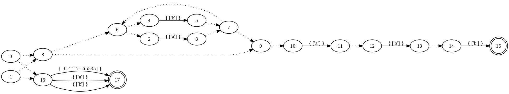

Utilisation de JFLex
====================

Ce TP a pour objectif de vous initier à l’utilisation de générateurs
lexicaux au travers de la reconnaissance des unités lexicales (tokens)
d’expressions arithmétiques, et de la reconnaissance des unités
lexicales de fichiers xml. Pour rappel, l’analyse lexicale (qui découpe
un flux d’entrée en tokens) se base sur la reconnaissance de motifs
associés à des expressions régulières (pour pouvoir utiliser des
automates finis). Nous allons utiliser ici l’outil JFlex destinés à
générer des analyseurs en Java. Sachez qu’il existe également des outils
similaires pour la plupart des autres langages (Lex en C pour le plus
connu).

JFlex: un générateur d’analyseurs lexicaux
==========================================

L’utilitaire [JFlex](http://jflex.de/) est un programme écrit en Java
qui génère le source Java d’un analyseur lexical à partir d’un fichier
de spécification. JFlex est dérivé de
[JLex](http://www.cs.princeton.edu/~appel/modern/java/JLex/) dont le
développement est arrêté. Ils sont compatibles, ce qui suit est donc
valable pour les deux logiciels.

Le contenu d’un fichier de spécification se compose essentiellement
d’une liste d’expressions régulières (du type de celles vues dans le TP
précédent), chaque expression décrivant comment reconnaître un token
particulier. On associe à chaque expression régulière une action (du
code Java) qui sera exécutée chaque fois que le scanner reconnaît un
motif correspondant à l’expression.

Le document suivant vous explique le format de ce fichier de
spécification, les manuels vous seront utiles si vous souhaitez plus de
précisions.

-   [Manuel de `JFlex` local](file:///usr/share/doc/jflex/doc/manual.html) ;

-   [Manuel de `JFlex`](http://jflex.de/manual.html);

Mise en œuvre[^1] sur l’exemple du cours-TD: `(a+b)*abb`
--------------------------------------------------------

Nous utilisons ici JFlex en mode *standalone*, i.e. dans le but de
produire simplement un scanner qui ne sera pas intégré à d’autres
outils. Voici le contenu du fichier [mfa.lex](mfa/mfa.lex)
destiné à produire un scanner reconnaissant les motifs correspondant à
l’expression rationnelle `(a+b)*abb`:

    %%
    %public
    %class Mfa
    %standalone
    %%
    (a|b)*abb        { System.out.println("Pattern "+yytext()+" matches."); }
    /* .*|\n {}*/    /* pour n'afficher que les motifs qui correspondent */

Le chemin de l'archive Java contenant JFlex est
reconnu par l'expression rationnelle 
`/usr/share/java/[Jj][Ff]lex(-full)?(-[0-9.]*)?\.jar`.
Trouvez-le sur votre poste du M5.

On exécute JFlex, pour un fichier de
spécification `specification.lex` donné, par la commande suivante :

    java -cp /usr/share/java/JFlex.jar JFlex.Main  specification.lex

en remplaçant éventuellement le *classpath* et la classe par les bons noms.

JFlex produit un fichier source Java contenant une classe dont le nom
correpond au nom donné dans la directive `%class`: `Mfa.java` ici. En
mode standalone, ce fichier contient le *scanner* (l’automate fini en
fait) et une fonction `Main` qui fait tourner ce scanner sur un fichier
dont le nom est attendu en argument. Dans notre cas, exécutez la
séquence de commandes suivante qui illustre la compilation et
l’exécution sur un fichier de test
[testmfa.txt](mfa/testmfa.txt):

    $ java -cp /usr/share/java/JFlex.jar JFlex.Main mfa.lex 
    Reading "mfa.lex"
    Constructing NFA : 14 states in NFA
    Converting NFA to DFA : 
    .......
    9 states before minimization, 8 states in minimized DFA
    Old file "Mfa.java" saved as "Mfa.java~"
    Writing code to "Mfa.java"
    $ javac Mfa.java 
    $ more testmfa.txt 
    abaababaaabb
    abb
    bb
    bbba
    $ java Mfa testmfa.txt 
    Pattern abaababaaabb matches.

    Pattern abb matches.

    bb
    bbba

Visualisation des automates
---------------------------

Il est possible de visualiser les automates construits par JFlex en mode
texte avec l’option `--dump`, ou en mode graphique avec l’option `--dot`
(`dot/graphviz` est un ensemble d’outils permettant la visualisation de
graphes). Essayez la séquence de commandes suivante:

    $ java -cp /usr/share/java/JFlex.jar JFlex.Main --dot mfa.lex
    Reading "mfa.lex"
    Constructing NFA : 14 states in NFA
    Converting NFA to DFA : 
    .......
    9 states before minimization, 8 states in minimized DFA
    Old file "Mfa.java" saved as "Mfa.java~"
    Writing code to "Mfa.java"
    $ ls *.dot
    dfa-big.dot  dfa-min.dot  nfa.dot
    $ dotty nfa.dot
    $ dot -Tpng nfa.dot > nfa.png
    $ gimp nfa.png

Les fichiers d’extension `.dot` contiennent les automates: `nfa.dot`
l’automate non déterministe initial, `dfa-big.dot` l’automate résultant
de la déterminisation du précédent et `dfa-min.dot` l’automate résultant
de la minimalisation du précédent. Le programme `dotty` affiche le
résultat à l’écran, le programme `dot` permet de produire une image (au
format `png` ici).

La partie supérieure correspond bien à l’automate que l’on avait
construit en Cours/TD, les $\epsilon$-transitions étant représentées en
pointillé sur cette image. La partie inférieure de l’automate produit
par JFlex correspond aux motifs non reconnus, pour lesquels il faut
également aboutir à un état final (l’action par défaut étant d’afficher
le texte correspondant, mais cela correspond à une erreur lexicale).
Vous pouvez visualiser l’automate déterministe et l’automate minimal
pour avoir une version correcte de ceux-ci, et également modifier
l’expression rationnelle du fichier `mfa.lex` pour construire d’autres
automates.

Production d’unités lexicales[^2] : expressions arithmétiques
-------------------------------------------------------------

Nous allons maintenant utiliser JFlex en mode de compatibilité
[CUP](http://www2.cs.tum.edu/projects/cup/) (l’analyseur syntaxique que
nous verrons plus tard). Dans ce mode, JFlex produit des objets de la
classe `Yylex` (fichier `Yylex.java`) dont la méthode principale est
`next_token`. Cette méthode renvoie un objet de classe
`java_cup.runtime.Symbol`([Symbol.java](https://www2.in.tum.de/repos/cup/develop/src/java_cup/runtime/Symbol.java))
. Pour information la classe `Yylex` implémente l’interface
`java_cup.runtime.Scanner`
([Scanner.java](https://www2.in.tum.de/repos/cup/develop/src/java_cup/runtime/Scanner.java)).

Voici un exemple de fichier de spécification
[`lexiArithm.lex`](exp/lexiArithm.lex) pour les expressions
arithmétiques. Vous y trouverez les tokens identificateur, entier, plus,
moins, multiplier, diviser, parenthèse ouvrante et parenthese fermante.
On y a ajouté un token `=` et un token `set` pour pouvoir assigner des
valeurs à des variables. Exécutez la séquence de commandes suivante:

    $ java -cp /usr/share/java/JFlex.jar JFlex.Main lexiArithm.lex
    Reading "lexiArithm.lex"
    Constructing NFA : 140 states in NFA
    Converting NFA to DFA : 
    ........................
    26 states before minimization, 17 states in minimized DFA
    Writing code to "Yylex.java"
    [levaire@lxo12 exp]$ ls -l
    total 24
    -rwxr-xr-x 1 levaire root  1452 mai  6 21:22 lexiArithm.lex
    -rwxr-xr-x 1 levaire root 16377 mai  6 21:32 Yylex.java

Le fichier `Yylex.java` contient donc l’analyseur lexical pour les
expressions arithmétiques. Pour utiliser cet analyseur, récupérez le
programme principal suivant
[TestLexiArithm.java](exp/TestLexiArithm.java). Ce programme
affichera simplement les tokens au fur et à mesure de la lecture de son
entrée. Il faut également définir des constantes entières pour
représenter les unités lexicales: ceci se fait par l’intermédiaire de la
classe `sym` (normalement créée par CUP) dans le fichier
[sym.java](exp/sym.java). Enfin une classe `LexicalException`
permet quant à elle de traiter (ici afficher) les erreurs lexicales.
Récupérez les fichiers [sym.java](exp/sym.java) et
[LexicalException.java](exp/LexicalException.java), compilez le
tout, et exécutez le programme sur un fichier de test
[entreeTest.txt](exp/entreeTest.txt) contenant un ensemble
d’expressions arithmétiques. Notez que l’on doit avoir accès à l’archive
contenant CUP car on a utilisé le mode de compatibilité avec CUP pour la
suite.

    $ javac -cp /usr/share/java/cup.jar LexicalException.java sym.java Yylex.java TestLexiArithm.java
    $ java -cp /usr/share/java/cup.jar:. TestLexiArithm entreeTest.txt
    Token #11
    Token #3
    Token #9
    Token #11
    Token #5
    ...

Le programme affiche la liste des numéros associés aux unités lexicales
reconnus dans le fichier d’entrée. Reportez-vous au fichier
[sym.java](exp/sym.java) pour avoir la correspondance
explicite.

Ajouter un token `FACTORIELLE` correspondant au terminal **`!`** de la
factorielle.

Scanner XML[^3]
===============

Nous voulons maintenant scanner des fichiers XML, et plus
particulièrement des fichiers Excel pour les transformer en fichier HTML
par exemple. La première étape est de récupérer la grammaire de XML qui
a été définie par le consortium [W3C](http://www.w3.org/) (World Wide
Web Consortium). XML version 1.0 est définie par la recommandation
[“Extensible Markup Language (XML) 1.0 (Fifth
Edition)”](http://www.w3.org/TR/REC-xml/REC-xml-20081126.xml) ([en
version locale](xml/w3c/REC-xml-20081126.xml)). Comme vous le
constatez, cette recommandation est elle-même écrite en XML et
l’affichage se fait par une transformation XSL à l’aide de la feuille de
style [`REC-xml.xsl`](xml/w3c/REC-xml.xsl) (voir la ligne
`<xml-stylesheet/>` dans le code source de la recommandation). J’ai
écrit une autre feuille de style [prod.xsl](xml/w3c/prod.xsl)
pour ne conserver que les règles de la grammaire XML à partir de la
spécification. Vous trouverez la grammaire complète sur cette
[page](xml/w3c/prod.html).

Nous n’allons pas écrire un scanner pour l’ensemble de XML, mais nous
limiter aux éléments XML définis par les règles (39)-(44):

    (39) element ::= EmptyElemTag | STag content ETag
    (40) STag ::= '<' Name (S Attribute)* S? '>'
    (41) Attribute ::= Name Eq AttValue
    (42) ETag ::= '</' Name S? '>'
    (43) content ::= CharData? ((element | Reference | CDSect | PI | Comment) CharData?)*
    (44) EmptyElemTag ::= '<' Name (S Attribute)* S? '/>'

Le programme [XmlScan.java](xml/XmlScan.java) réalise la
reconnaissance[^4] des débuts et fins d’éléments XML (règles (40), (42)
et (44) ci-dessus). Il repose sur un scanner JFlex reconnaissant les
symboles:

-   `sym.EOF`: fin de fichier;

-   `sym.LT`: caractère ’&lt;’;

-   `sym.LTSLASH`: caractères ’&lt;/’;

-   `sym.GT`: caractère ’&gt;’;

-   `sym.SLASHGT`: caractères ’/&gt;’;

-   `sym.NAME`: un nom d’élément;

Pour tout autre caractère, le scanner renvoie le symbole `sym.UNKNOWN`.

Écrire les fichiers `sym.java` et `xml-element.lex` permettant de
construire un scanner JFlex reconnaissant l’ensemble des symboles
ci-dessus. Les noms d’éléments XML (variable `Name` dans les règles
ci-dessus) sont définis par les règles suivantes:

    (4) NameStartChar ::= ":" | [A-Z] | "_" | [a-z] | [#xC0-#xD6] | [#xD8-#xF6] | 
              [#xF8-#x2FF] | [#x370-#x37D] | [#x37F-#x1FFF] | [#x200C-#x200D]| 
              [#x2070-#x218F] | [#x2C00-#x2FEF] | [#x3001-#xD7FF] | [#xF900-#xFDCF] | 
              [#xFDF0-#xFFFD] | [#x10000-#xEFFFF]
    (4a) NameChar ::= NameStartChar | "-" | "." | [0-9] | #xB7 | [#x0300-#x036F] | [#x203F-#x2040]
    (5) Name ::= NameStartChar (NameChar)*

Les caractères Unicode sont préfixés en JFlex par `\u` ou `\U` au lieu
de `#x`: `\udddd` pour un caractère sur 16 bits, et `\Udddddd` pour un
caractère sur 24 bits [^5].

Pour ceux connaissant [ant](http://ant.apache.org/), un fichier
[build.xml](xml/build.xml) permet de construire les exercices
dans le répertoire `/tmp` depuis un répertoire source de votre choix.
Consulter le contenu du fichier pour respecter la hiérarchie utilisée
pour les sources.

Voici un exemple d’exécution sur le fichier XML
[suivant](xml/cdcatalog.xml):

    $ more cdcatalog.xml 
    <?xml version="1.0" encoding="ISO-8859-1"?>
    <!--<?xml-stylesheet href="cdcatalog.xsl" type="text/xsl"?>-->

    <catalog>
      <cd>
        <title>Live Rust</title>
        <artist>Neil Young and Crazy Horse</artist>
        <country>USA</country>
        <company>Reprise Records</company>
        <year>1979</year>
      </cd>
      <cd>
        <title>Houses of the Holy</title>
        <artist>Led Zeppelin</artist>
        <country>UK</country>
        <company>Atlantic Records</company>
        <year>1973</year>
      </cd>
    </catalog>
    $ java -cp /usr/share/java/java_cup-runtime.jar:. XmlScan cdcatalog.xml 
    Start element: catalog
    Start element: cd
    Start element: title
    End element: title
    Start element: artist
    End element: artist
    Start element: country
    End element: country
    Start element: company
    End element: company
    Start element: year
    End element: year
    End element: cd
    Start element: cd
    Start element: title
    End element: title
    Start element: artist
    End element: artist
    Start element: country
    End element: country
    Start element: company
    End element: company
    Start element: year
    End element: year
    End element: cd
    End element: catalog
    End of scanning

Modifier les fichiers `sym.java`, `Xmlscan.java` et `xml-element.lex`
pour construire un scanner JFlex reconnaissant également les contenus
des éléments XML. Le contenu d’un élément XML est défini par la règle
suivante

    (43) content ::= CharData? ((element | Reference | CDSect | PI | Comment) CharData?)*

et le scanner reconnaît d’ores et déjà les contenus `element*`. Vous
vous limiterez aux contenus de type texte `CharData? (CharData?)*` (non
mixés avec des éléments XML donc). Les contenus de type texte (variable
`CharData` dans les règles ci-dessus) sont définis par la règle
suivante:

    (14) CharData ::= [^<&]* - ([^<&]* ']]>' [^<&]*)

Notez l’utilisation de la différence ensembliste (rappelez-vous que les
langages sont des ensembles). La différence en JFlex est obtenue en
utilisant une loi de Morgan: `a - b = !(!a  | b))`. Vous placerez la
reconnaissance des contenus d’éléments XML dans le fichier
`Xmlscan.java`, dans un `else` suivant la reconnaissance d’un élément
vide[^6].

Prenez garde au fait que la règle `CharData` inclut la règle `Name`. Il
faut donc la *désactiver* quand on souhaite reconnaître des noms
d’éléments XML, sinon ceux-ci ne seront jamais reconnus. En effet, JFLex
choisit toujours la correspondance la plus longue et une entrée
`element>` sera reconnue comme un `CharData` et non comme `Name` suivi
de `>`. Pour activer/désactiver certaines règles, JFLex dispose d’un
système d’états: on déclare un état `A` avec la directive `%states A`,
puis en préfixant certaines règles avec un nom d’état entre chevrons
`<A>`, elles ne seront actives que si l’analyseur lexical est dans cet
état. Les changements d’états se font avec la primitive `yybegin(A)`.
L’état par défaut se nomme `YYINITIAL`. Dans notre cas, il suffit de
déclarer un état `INELEMENT`, de n’activer la règle `CharData` que dans
cet état, et de placer l’analyseur lexical dans l’état `INELEMENT` au
début de la reconnaissance des contenus d’éléments XML depuis le fichier
`Xmlscan.java`. On le replacera dans l’état par défaut à la fin de la
reconnaissance des contenus d’éléments.

Modifier les fichiers `sym.java`, `Xmlscan.java` et `xml-element.lex`
pour construire un scanner JFlex reconnaissant également les attributs
des éléments XML. Les attributs d’un élément XML sont définis par les
règles suivantes

    (41) Attribute ::= Name Eq AttValue 
    (25) Eq ::= S? '=' S?
    (10) AttValue ::= '"' ([^<&"] | Reference)* '"' |  "'" ([^<&'] | Reference)* "'"
    (66) CharRef ::= '&#' [0-9]+ ';' | '&#x' [0-9a-fA-F]+ ';'
    (67) Reference ::= EntityRef | CharRef
    (68) EntityRef ::= '&' Name ';'

Vous placerez la reconnaissance des attributs d’éléments XML dans le
fichier `Xmlscan.java`, dans la boucle suivant la reconnaissance d’un
début d’élément XML[^7]. Pensez à despécialiser le guillemet en JFLex
(`\"`).

**Application aux fichiers Excel au format Office Open XML**

Le format Office Open XML est un format ouvert défini par
l’International Standard Organization (ISO) dans un ensemble de
documents divers dont:

-   [Part 1: Fundamentals and Markup Language
    Reference](http://standards.iso.org/ittf/PubliclyAvailableStandards/c061750_ISO_IEC_29500-1_2012.zip)

-   [Part 2: Open Packaging
    Conventions](http://standards.iso.org/ittf/PubliclyAvailableStandards/c061796_ISO_IEC_29500-2_2012.zip)

Le premier document contient l’ensemble des éléments XML (et leurs
attributs) utilisés dans les documents Word, Calc, Impress/Powerpoint ou
Draw. Le second décrit le contenant d’un tel document, une archive
`zip`. Récupérez le fichier
[`salesdata.xlsx`](xml/salesdata.xlsx) et décompressez-le avec
`unzip` dans le répertoire `/tmp/salesdata`. Les fichiers de l’archive
qui nous intéressent dans la suite sont:

-   `xl/workbook.xml` : l’élément `<sheets>` de ce fichier contient la
    liste des feuilles du fichier Excel avec un élément fils `<sheet>`
    par feuille. Dans notre cas, il n’y a qu’une feuille, et nous n’en
    tiendrons pas compte.

-   `xl/worksheets/sheet1.xml` : ce fichier contient les données de la
    feuille 1. Les liens entre feuille (ou identifiant de feuille) et
    nom de fichier se font dans les sous-répertoires `_rels`.

-   `xl/sharedStrings.xml`: contient les chaines de caractères présentes
    dans les feuilles. Elles sont référencées dans les feuilles par leur
    rang dans ce fichier.

L’objectif de l’exercice est de transformer un fichier Excel en une page
HTML. On supposera le fichier Excel déjà désarchivé dans un répertoire
`srcxlsx` dont le nom sera passé en argument du programme [^8]. Pour
produire la table HTML correspondant à la feuille Excel, votre programme
doit donc:

1.  lire et scanner (avec le scanner XML de la question précédente) le
    fichier `srcxlsx/xl/sharedStrings.xml` et construire une `ArrayList`
    `shared` contenant les chaînes de caractères des feuilles Excel du
    fichier. Il suffit pour cela de ne retenir que les éléments XML de
    nom `t` et d’ajouter au fur et à mesure leur contenu (qui est une
    chaîne de caractères) à la fin de la liste `shared`.

2.  lire et scanner (avec le scanner XML de la question précédente) le
    fichier `srcxlsx/xl/worksheets/sheet1.xml` et générer en sortie:

 -  une balise `<tr>` en début d’élément XML de nom `<row>`

 -  une balise `</tr>` en fin d’élément XML de nom `</row>`

 -  une balise `<td>` en début d’élément XML de nom `<c>`

 -  une balise `</td>` en fin d’élément XML de nom `</c>`

 -  les contenus des éléments de nom XML `<v>`. Pour les chaînes de
    caractères, ce contenu sera le rang de la chaîne dans la liste
    `shared`. Les éléments `v` étant des fils des éléments `c`, on
    détermine si ils contiennent une chaîne de caractères si
    l’élément `c` parent possède un attribut de nom `t` dont la
    valeur est `''s''` (notez la présence des guillemets ici).

Voici un exemple d’exécution avec le fichier `salesdata.xlsx`.

    $ mkdir /tmp/salesdata
    $ cd /tmp/salesdata
    $ unzip ~/salesdata.xlsx
    $ java -cp /usr/share/java/java_cup-runtime.jar:/tmp/build/Q5-xlsx2html/ Xlsx2Html /tmp/salesdata/ > salesdata.html
    1. Reading shared strings from /tmp/salesdata//xl/sharedStrings.xml
    Found 138 shared strings
    2. Reading sheet data from /tmp/salesdata//xl/worksheets/sheet1.xml
    Total 391 rows, 1955 cells

Le fichier [`salesdata.html`](xml/salesdata.html) résultant de
la redirection contient la table  demandée.

[^1]: Placez vous dans un répertoire `mfa`

[^2]: Placez vous dans un répertoire `exp`

[^3]: Placez vous dans un répertoire `xml`

[^4]: Les scanners XML fonctionnent également sur ce principe: leur
    utilisation se fait en fournissant des fonctions `callback` appelées
    en début/fin d’éléments XML, d’attributs, …. Ceci évite de devoir
    charger l’ensemble du document XML pour le parser.

[^5]: Ne pas utiliser `Udddddd` avec une version de JFlex inférieure à
    1.4.3 incluse.

[^6]: `if (symb.sym == sym.SLASHGT)... else ...`

[^7]: `do { ... } while ((symb.sym != sym.SLASHGT) && (symb.sym != sym.GT));`

[^8]: Vous pouvez aussi implémenter la phase de désarchivage dans votre
    programme Java.
